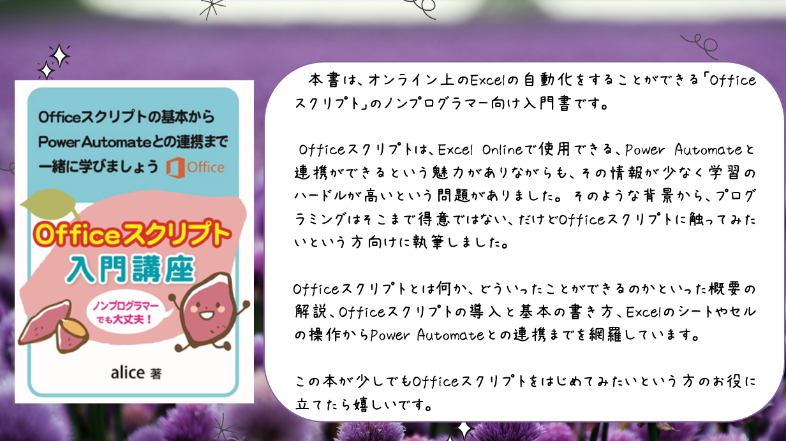

# Officeスクリプト入門講座
***
この資料は『Officeスクリプト入門講座』のサンプルコードです。

技術書典のページはこちらです。  
[Officeスクリプト入門講座](https://techbookfest.org/product/5760447208751104?productVariantID=4791751158005760&utm_campaign=share&utm_medium=social&utm_source=twitter)

## サンプルコード
***
サンプルコードはこちらからご確認ください。 
   
[2. Officeスクリプトを書いてみよう](2_try_to_write.md)  
[3. Officeスクリプトの基本を学ぼう](3_learn_the_basics.md)  
[4. Officeスクリプトで制御構文を使ってみよう](4_try_to_use_control_syntax.md)  
[5. Officeスクリプトでセルを操作しよう](5._manipulate_cells.md)  
[6. OfficeスクリプトをPowerAutomateで使ってみよう](6_PowerAutomate.md)